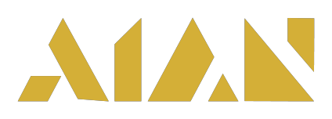
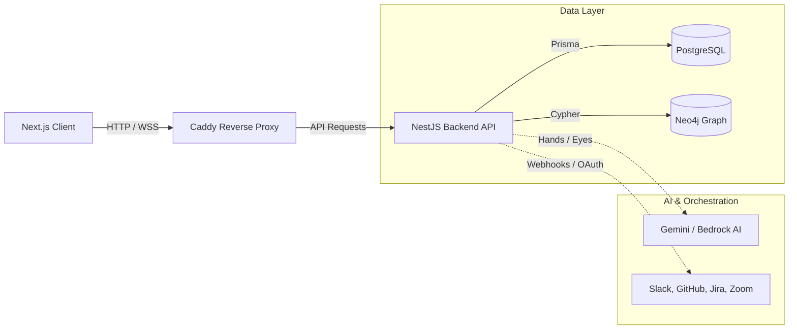

<p align="center">
  
</p>

<p align="center">
  <h1 align="center">Aian</h1>
  <p align="center">
    <em>AI-Driven Workspace & Orchestration Platform</em>
  </p>
</p>

<p align="center">
  
  
  
  
  
  
</p>

---

## Overview

**Aian** is a comprehensive, AI-integrated workspace orchestration platform. It merges advanced knowledge graph retrieval with autonomous agentic skills and multimodal context processing to automate enterprise workflows. Featuring deep integrations with essential workplace tools and a powerful permissions system, Aian is built to handle complex, automated operations securely and efficiently.

---

## Key Features

- **Agentic Skills (Hands)**: Orchestrator engine allowing AI to execute structured programmatic skills and automated workflows with full audit logging.
- **Multimodal Context (Eyes)**: Advanced vision and file processing pipelines for deep environmental context understanding.
- **Knowledge Graph RAG**: Built-in Neo4j ingestion and retrieval pipeline providing highly contextual AI resolutions over complex data.
- **Enterprise Integrations**: Native OAuth integrations with Jira, GitHub, Slack, Trello, Zoom, and Meeting-Baas.
- **Workspace & RBAC**: Granular roles, permissions, and multi-tenant workspace administration.
- **Integrated Billing**: End-to-end payment processing and subscription management powered by Paymob.

---

## Tech Stack

| Category      | Technologies                                                                                     |
| ------------- | ------------------------------------------------------------------------------------------------ |
| **Frontend**  | Next.js 15, React 19, Tailwind CSS v4, Radix UI, Zustand, SWR, React Force Graph 2D              |
| **Backend**   | NestJS 11, Prisma ORM, Passport (OAuth/JWT), @google/genai, Marked                               |
| **Databases** | PostgreSQL 16 (Relational Data), Neo4j 5 (Knowledge Graph)                                       |
| **DevOps**    | Docker, Docker Compose, Caddy (Reverse Proxy)                                                    |

---

## Architecture



<!-- TODO: add screenshot(s) to /docs/screenshots and embed here -->

---

## Getting Started

### Prerequisites
- [Docker & Docker Compose](https://www.docker.com/)
- [Node.js 20+](https://nodejs.org/) (if running locally without Docker)

### Installation

1. **Clone the repository**
   ```bash
   git clone <your-repo-url>
   cd aian
   ```

2. **Install Dependencies**
   The project is organized as a monolith. Install dependencies for both ends:
   ```bash
   # Client
   cd client
   npm install
   
   # Server
   cd ../server
   npm install
   ```

### Environment Variables

Configure the required environments. Copy the example files and populate them with your secrets.

```bash
cp client/.env.example client/.env
cp server/.env.example server/.env
```

<details>
<summary><strong>View Backend Environment Variables (server/.env)</strong></summary>

| Variable | Description | Required |
|----------|-------------|:--------:|
| `PORT` | API port (default: 1234) | Yes |
| `POSTGRES_USER` / `POSTGRES_PASSWORD` / `POSTGRES_DB` | PostgreSQL credentials | Yes |
| `DATABASE_URL` | Full Prisma connection string | Yes |
| `FRONTEND_URL` | Frontend URL for CORS (default: `http://localhost:3000`) | Yes |
| `JWT_SECRET` / `JWT_SECRET_REFRESH_TOKEN` | JWT signing secrets | Yes |
| `ENCRYPTION_KEY` | 64-character hex string for AES-256 token encryption | Yes |
| `PAYMOB_SECRET_KEY` / `PAYMOB_PUBLIC_KEY` ... | Paymob billing configuration | Optional |
| `GOOGLE_CLIENT_ID` / `GITHUB_CLIENT_ID` ... | OAuth application credentials | Optional |
| `SLACK_CLIENT_ID` / `JIRA_CLIENT_ID` ... | Integration OAuth credentials | Optional |
| `AI_API_KEY` / `GEMINI_API_KEY` | Bedrock / Gemini API keys | Yes |
| `NEO4J_URI` / `NEO4J_USER` / `NEO4J_PASSWORD` | Knowledge Graph credentials | Yes |
| `SMTP_HOST` / `SMTP_USER` / `SMTP_PASS` | Email configuration | Yes |

</details>

<details>
<summary><strong>View Frontend Environment Variables (client/.env)</strong></summary>

| Variable | Description | Required |
|----------|-------------|:--------:|
| `API_URL` | Internal API Route | Yes |
| `NEXT_PUBLIC_API_URL` | Public-facing API URL (default: `http://localhost:1234/api/v1`) | Yes |

</details>

### Running the App

**Option A: Using Docker (Recommended)**
Brings up PostgreSQL, Neo4j, Caddy, Next.js, and NestJS in a unified environment.
```bash
docker-compose up --build
```
<!-- TODO: replace with live deployment URL -->

**Option B: Local Development**
Run the supporting databases via Docker, and apps locally.
```bash
# Start databases
docker-compose up postgres neo4j -d

# Start backend (in /server)
npm run db:generate
npm run db:migrate
npm run start:dev

# Start frontend (in /client)
npm run dev
```

### Running Tests (Backend)
```bash
cd server
npm run test          # Unit tests
npm run test:e2e      # End-to-end tests
npm run test:cov      # Coverage report
```

---

## Project Structure

```text
aian/
├── client/              # Next.js 15 Frontend
│   ├── src/app/         # Next.js App Router pages (auth, admin, dashboard, onboarding)
│   ├── src/components/  # Shared Radix UI & custom components
│   ├── src/store/       # Zustand state stores
│   └── src/hooks/       # Custom React hooks & SWR fetches
├── server/              # NestJS 11 Backend
│   ├── prisma/          # PostgreSQL schemas & migrations
│   ├── src/hands/       # Agentic orchestrated skills engine
│   ├── src/eyes/        # Vision processing & multimodal inputs
│   ├── src/graph/       # Neo4j knowledge graph adapters
│   ├── src/integrations/# OAuth & webhook handlers (Jira, Slack, GitHub, Zoom)
│   └── src/auth/        # Authentication & Role-Based Access Control
├── docs/                # Extended documentation and guides (Sprints, DB Schema)
├── docker-compose.yml   # Multi-container orchestration
└── Caddyfile            # Reverse proxy configuration
```

---

## Contributing

We welcome contributions! Please review our documentation under `/docs` for architectural guidelines, such as the `Knowledge_Assembler_Guide.md` and `SKILL_DEVELOPMENT_GUIDE.md` before submitting a pull request.

---

## Contributors

- [Amir Alsayed](https://github.com/amiresaye6)
- [Amir Abdulmawla](https://github.com/AmirMawla)
- [Mohamed Elazazzy](https://github.com/Azzazy6269)
- [Donia Mohamed](https://github.com/doniaamohamed)
- [Hager Nofal](https://github.com/hagernofal)

---

## License

This project is licensed under a **Custom Proprietary License** that restricts commercial use. See the [LICENSE](./LICENSE) file for more details. For commercial inquiries, contact `amiralsayed.work@gmail.com`.
