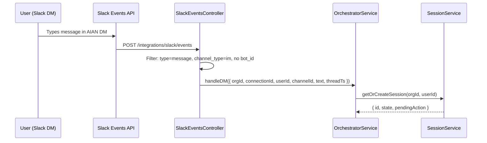
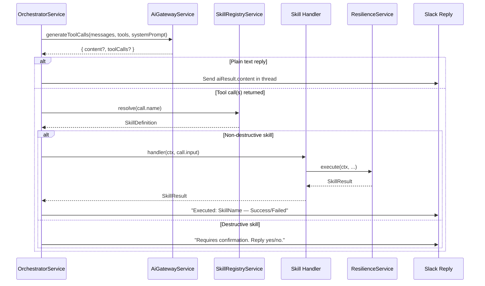
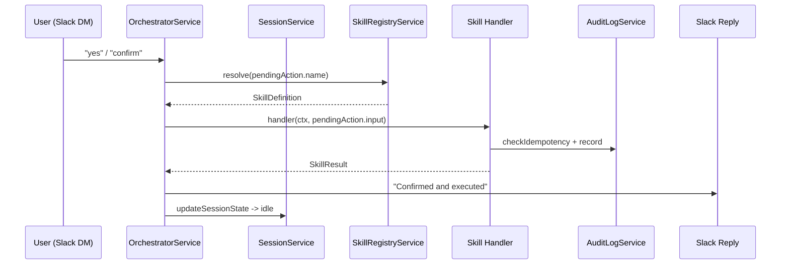
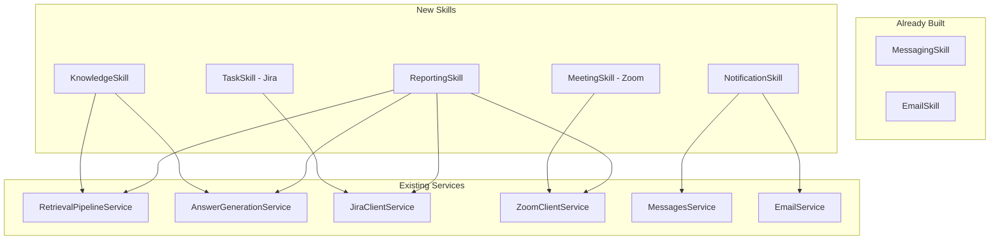

# AIAN Skills Specification — Customized for Codebase

> **Baseline:** Messaging Skill + Email Skill are live. This document specifies the 5 remaining skills, customized against the actual AIAN infrastructure.

---

## How the Orchestrator Works (End-to-End Flow)

Before diving into individual skills, here is exactly what happens when a user sends a message to the AIAN Slack bot — from keystroke to response, broken into three stages.

### Stage 1 — Message Ingestion

A Slack DM arrives, gets routed to the correct organization, and enters the Orchestrator.



### Stage 2 — LLM Decision & Skill Dispatch

The Orchestrator sends the user's message + all registered skill definitions to the LLM. The LLM decides: plain text reply, or one or more tool calls.



### Stage 3 — Destructive Action Confirmation

If the LLM chose a destructive skill (e.g., `deleteTask`), the session enters a `confirming` state. The user's next DM is routed here.



### Key architectural takeaways

| Concept | How it works in AIAN |
|---|---|
| **Entry point** | [SlackEventsController](../../server/src/integrations/slack/slack-events.controller.ts) isolates DMs (`channel_type === 'im'` && no `bot_id`) and routes them to the Orchestrator. Group/channel messages go to the Eyes pipeline instead. |
| **Session state machine** | [SessionService](../../server/src/hands/orchestrator/session.service.ts) — states: `idle → confirming → executing → idle`. Persisted in `handsSession` table (Prisma). |
| **Skill discovery** | Every skill class implements `OnModuleInit` and calls `this.registry.register(...)` at boot. The Orchestrator calls `registry.getAllDefinitions()` to build the LLM's tool list. |
| **Tool selection** | The LLM (via [AiGatewayService.generateToolCalls](../../server/src/ai/ai-gateway.service.ts)) decides which skill to invoke based on the user's natural language input and each skill's `name` + `description` + `schema`. |
| **Destructive gate** | If `SkillDefinition.destructive === true`, the Orchestrator pauses execution, stores the pending action in the session, and asks the user for confirmation before proceeding. |
| **Resilience** | [ResilienceService](../../server/src/hands/core/resilience.service.ts) wraps every skill execution with idempotency checks and audit logging via [AuditLogService](../../server/src/hands/audit/audit-log.service.ts). |
| **Reply delivery** | The Orchestrator uses `ProviderClientFactory` to get the Slack client and calls `sendMessage()` to reply in the same DM thread. |

### The `SkillContext` object (passed to every handler)

```typescript
// from server/src/hands/core/types.ts
interface SkillContext {
  organizationId: string;   // The org executing the session
  actorUserId: string;       // Slack user ID of the requester
  connectionId: string;      // ProviderConnection UUID (Slack workspace)
  sessionId: string;         // Orchestrator session ID
  idempotencyKey: string;    // Unique key for dedup (sessionId-timestamp)
  traceId: string;           // For distributed tracing
}
```

### The `SkillResult<T>` return type (returned by every handler)

```typescript
// from server/src/hands/core/types.ts
interface SkillResult<T = unknown> {
  success: boolean;
  data?: T;
  error?: { code: string; message: string; retryable: boolean };
  meta: { skill: string; provider: string; durationMs: number; idempotencyKey: string };
}
```

---

## File Structure for All New Skills

```
server/src/hands/skills/
├── schemas.ts                   ← ADD new Zod schemas here (existing file)
├── email.skill.ts               ← (existing, live)
├── messaging.skill.ts           ← (existing, live)
├── knowledge.skill.ts           ← NEW
├── task.skill.ts                ← NEW (Jira)
├── meeting.skill.ts             ← NEW (Zoom)
├── notification.skill.ts        ← NEW
└── reporting.skill.ts           ← NEW
```

All schemas go into the shared [schemas.ts](../../server/src/hands/skills/schemas.ts). Each skill is a single class file. No sub-directories needed.

---

## Skill 1: Knowledge Skill

**Purpose.** Expose the existing GraphRAG retrieval pipeline as orchestrator-callable tool methods so the agent can answer questions, search artifacts, and summarize topics.

### Codebase Dependencies (already built, reuse as-is)

| Service | Location | What it does |
|---|---|---|
| `RetrievalPipelineService` | [retrieval-pipeline.service.ts](../../server/src/retrieval/retrieval-pipeline.service.ts) | Orchestrates the 6-stage GraphRAG pipeline (query → entities → graph search → ranking → evidence chains → context string) |
| `AnswerGenerationService` | [answer-generation.service.ts](../../server/src/retrieval/services/answer-generation.service.ts) | Takes the context string and generates a grounded LLM answer |
| `QueryUnderstandingService` | [query-understanding.service.ts](../../server/src/retrieval/services/query-understanding.service.ts) | Extracts entities, intent, people, timeRange from a natural language query |
| `GraphSearchService` | [graph-search.service.ts](../../server/src/retrieval/services/graph-search.service.ts) | Neo4j Cypher queries to find and rank artifacts by graph distance |
| `EvidenceChainService` | [evidence-chain.service.ts](../../server/src/retrieval/services/evidence-chain.service.ts) | Fetches `KnowledgeArtifact` records from Postgres and builds chronological evidence chains |
| `ContextBuilderService` | [context-builder.service.ts](../../server/src/retrieval/services/context-builder.service.ts) | Formats evidence chains into a context string for the LLM |

### Public Interface (registered methods)

| Method | Schema Input | Output | Destructive |
|---|---|---|---|
| `answerQuestion` | `{ question: string }` | `{ answer: string, sources: EvidenceNode[], confidence: number }` | No |
| `search` | `{ query: string, artifactTypes?: string[] }` | `{ results: EvidenceNode[] }` | No |
| `summarize` | `{ topic: string, scope?: string }` | `{ summary: string, sources: EvidenceNode[] }` | No |

### Implementation Notes

- **`answerQuestion`**: Calls `RetrievalPipelineService.retrieveContext(orgId, question)` → gets `{ contextString, evidenceChains }` → passes to `AnswerGenerationService.generateAnswer(question, contextString)` → returns `{ answer, sources: evidenceChains }`. This is exactly what [ChatController.askQuestion](../../server/src/retrieval/chat.controller.ts) already does — we are just wrapping it as a skill.
- **Confidence score**: Derive from `evidenceChains.length` and max `relevanceScore` across chains. If `evidenceChains.length === 0`, return `{ answer: "I don't have enough context on this in the knowledge graph.", confidence: 0 }`.
- **`search`**: Calls `QueryUnderstandingService.analyzeQuery(query)` → `GraphSearchService.searchAndRankArtifacts(orgId, entities)` → `EvidenceChainService.constructChain(orgId, ranked)`. If `artifactTypes` is provided, filter the final results by `type` field.
- **`summarize`**: Same as `answerQuestion` but with a modified prompt prefix asking for a summary rather than a direct answer.

### Module Changes

- `HandsModule.imports` must add `RetrievalModule` (it already exports all services we need).

> [!IMPORTANT]
> The `RetrievalModule` already exports `RetrievalPipelineService`, `AnswerGenerationService`, and all sub-services. We just need to add it to `HandsModule.imports`. No new modules required.

### Zod Schemas to Add to `schemas.ts`

```typescript
export const AnswerQuestionInputSchema = z.object({
  question: z.string().describe('The natural language question to answer from the knowledge graph.'),
});

export const SearchInputSchema = z.object({
  query: z.string().describe('The search query to find relevant knowledge artifacts.'),
  artifactTypes: z.array(z.string()).optional().describe('Optional filter: artifact types like "message", "meeting", "task", "pr".'),
});

export const SummarizeInputSchema = z.object({
  topic: z.string().describe('The topic to summarize from the knowledge graph.'),
  scope: z.string().optional().describe('Optional scope constraint, e.g., a project name or team.'),
});
```

---

## Skill 2: Task Skill (Jira)

**Purpose.** Create and manage Jira issues from the Slack DM chat.

### Codebase Dependencies

| Service | Location | What it does | Reusable? |
|---|---|---|---|
| `JiraClientService` | [jira-client.service.ts](../../server/src/integrations/jira/services/jira-client.service.ts) | Full Jira REST API client with OAuth token refresh, base URL builder, header construction | ✅ **Yes** — it has `getValidToken()`, `buildHeaders()`, `getBaseUrl()` and `getMembers()`. However, it currently only has **read** methods. We need to **add write methods** to this service. |
| `ProviderConnectionRepository` | [provider-connection.repository.ts](../../server/src/ingestion/repositories/provider-connection.repository.ts) | Looks up connections by org/provider | ✅ Yes |
| `PrismaService` | — | Database access | ✅ Yes |

### What Needs to Be Added to `JiraClientService`

The existing `JiraClientService` only has read operations (verify, getResources, getMembers, syncHistorical). The following write methods need to be added **to the client service itself**, not the skill:

```typescript
// New methods to add to JiraClientService
async createIssue(connection, { projectKey, summary, description, assigneeAccountId, priority, labels, dueDate }): Promise<{ id, key, self }>
async updateIssue(connection, issueIdOrKey, fields): Promise<void>
async transitionIssue(connection, issueIdOrKey, transitionId): Promise<void>
async getTransitions(connection, issueIdOrKey): Promise<Transition[]>
async addComment(connection, issueIdOrKey, body): Promise<{ id }>
async deleteIssue(connection, issueIdOrKey): Promise<void>
async searchIssues(connection, jql, maxResults?, startAt?): Promise<{ issues, total }>
async getIssue(connection, issueIdOrKey): Promise<JiraIssue>
async findUser(connection, query): Promise<JiraUser[]>
```

> [!WARNING]
> **OAuth Scope**: The existing Jira OAuth app likely only has read scopes (from the Eyes pipeline). You need to verify and add `write:jira-work` scope to the Atlassian OAuth app configuration. This is a **configuration change in Atlassian Developer Console**, not a code change.

### Public Interface (registered methods)

| Method | Destructive |
|---|---|
| `createTask` | No |
| `updateTask` | No |
| `assignTask` | No |
| `moveTask` | No |
| `comment` | No |
| `deleteTask` | **Yes** — requires confirmation |
| `listTasks` | No |
| `getTask` | No |

### Connection Resolution Pattern

The skill needs to find the Jira `ProviderConnection` for the user's organization. Pattern:

```typescript
const connection = await this.prisma.providerConnection.findFirst({
  where: {
    organizationId: ctx.organizationId,
    provider: { key: 'jira' },
    status: 'connected',
  },
  include: { provider: true },
});
```

### Transition Resolution (moveTask)

Jira transitions are workflow-specific. `moveTask({ taskId, targetStatus: "In Progress" })` must:
1. Call `jiraClient.getTransitions(connection, taskId)` to get available transitions.
2. Find the transition whose `name` case-insensitively matches `targetStatus`.
3. Call `jiraClient.transitionIssue(connection, taskId, transition.id)`.
4. If no match: return `{ success: false, error: { code: 'INVALID_TRANSITION', message: 'Available statuses: ...', retryable: false } }`.

### Assignee Resolution

`assignTask` / `createTask` with an assignee must resolve a human name to a Jira `accountId`:
1. Call `jiraClient.findUser(connection, assigneeName)`.
2. If exactly one match, use it. If zero or multiple, return an error listing matches.

### Zod Schemas to Add

```typescript
export const CreateTaskInputSchema = z.object({
  title: z.string().describe('The title/summary of the Jira issue.'),
  description: z.string().optional().describe('Detailed description of the task.'),
  assignee: z.string().optional().describe('Name of the person to assign. Will be resolved to a Jira account.'),
  priority: z.string().optional().describe('Priority level: Highest, High, Medium, Low, Lowest.'),
  dueDate: z.string().optional().describe('Due date in YYYY-MM-DD format.'),
  labels: z.array(z.string()).optional().describe('Labels to apply to the issue.'),
  projectKey: z.string().describe('The Jira project key, e.g., "AIAN" or "DEV".'),
});

export const UpdateTaskInputSchema = z.object({
  taskId: z.string().describe('The Jira issue key, e.g., "AIAN-123".'),
  fields: z.record(z.string(), z.any()).describe('Fields to update, e.g., { summary: "New title" }.'),
});

export const AssignTaskInputSchema = z.object({
  taskId: z.string().describe('The Jira issue key.'),
  assignee: z.string().describe('Name of the person to assign.'),
});

export const MoveTaskInputSchema = z.object({
  taskId: z.string().describe('The Jira issue key.'),
  targetStatus: z.string().describe('The target status name, e.g., "In Progress", "Done".'),
});

export const CommentTaskInputSchema = z.object({
  taskId: z.string().describe('The Jira issue key.'),
  text: z.string().describe('The comment text to add.'),
});

export const DeleteTaskInputSchema = z.object({
  taskId: z.string().describe('The Jira issue key to delete.'),
});

export const ListTasksInputSchema = z.object({
  projectKey: z.string().optional().describe('Filter by project key.'),
  assignee: z.string().optional().describe('Filter by assignee name.'),
  status: z.string().optional().describe('Filter by status name.'),
  dateRange: z.object({
    from: z.string().optional(),
    to: z.string().optional(),
  }).optional().describe('Filter by date range.'),
});

export const GetTaskInputSchema = z.object({
  taskId: z.string().describe('The Jira issue key.'),
});
```

---

## Skill 3: Meeting Skill (Zoom)

**Purpose.** Create and manage Zoom meetings from the Slack DM chat.

### Codebase Dependencies

| Service | Location | Reusable? |
|---|---|---|
| `ZoomClientService` | [zoom-client.service.ts](../../server/src/integrations/zoom/zoom-client.service.ts) | ✅ Partially — has `verifyConnection()`, `getResources()`, `getMeetingDetails()`, `refreshAccessToken()`. Missing write operations. |
| `MeetingBaasService` | [meeting-baas.service.ts](../../server/src/integrations/zoom/meeting-baas.service.ts) | External meeting bot service (for recording/transcription). Not needed for this skill. |

### What Needs to Be Added to `ZoomClientService`

```typescript
// New methods to add to ZoomClientService
async createMeeting(connection, { topic, startTime, duration, timezone, agenda, attendees }): Promise<{ id, join_url, start_url }>
async updateMeeting(connection, meetingId, fields): Promise<void>
async deleteMeeting(connection, meetingId): Promise<void>
async listMeetings(connection, { userId?, dateRange? }): Promise<Meeting[]>
async addRegistrants(connection, meetingId, attendees: string[]): Promise<void>
```

> [!WARNING]
> **OAuth Scope**: The existing Zoom app likely only has read + webhook scopes. You need `meeting:write:admin` scope added. Also confirm the host user is a **licensed** Zoom user — meetings can't be created as a Basic (free) user.

### Public Interface (registered methods)

| Method | Destructive |
|---|---|
| `createMeeting` | No |
| `updateMeeting` | No |
| `cancelMeeting` | **Yes** — requires confirmation |
| `invite` | No |
| `getMeeting` | No |
| `listMeetings` | No |

### Connection Resolution

Same pattern as Task Skill but with `provider.key = 'zoom'`.

### Timezone Handling

> [!IMPORTANT]
> The Zoom API requires `timezone` as a separate field (e.g., `"Africa/Cairo"`) alongside `start_time` in ISO 8601. When the user says "tomorrow at 2pm", the Orchestrator's LLM must resolve this to a concrete ISO timestamp. We should include the user's timezone context in the schema description to guide the LLM. For v1, the LLM is responsible for this resolution — we don't build a separate timezone service.

### Zod Schemas to Add

```typescript
export const CreateMeetingInputSchema = z.object({
  topic: z.string().describe('The meeting topic/title.'),
  startTime: z.string().describe('ISO 8601 start time with timezone, e.g., "2026-08-01T14:00:00".'),
  durationMinutes: z.number().describe('Duration of the meeting in minutes.'),
  timezone: z.string().optional().describe('IANA timezone, e.g., "Africa/Cairo". Defaults to UTC.'),
  attendees: z.array(z.string()).optional().describe('List of attendee email addresses.'),
});

export const UpdateMeetingInputSchema = z.object({
  meetingId: z.string().describe('The Zoom meeting ID.'),
  fields: z.record(z.string(), z.any()).describe('Fields to update: topic, start_time, duration, etc.'),
});

export const CancelMeetingInputSchema = z.object({
  meetingId: z.string().describe('The Zoom meeting ID to cancel.'),
});

export const InviteMeetingInputSchema = z.object({
  meetingId: z.string().describe('The Zoom meeting ID.'),
  attendees: z.array(z.string()).describe('Email addresses of attendees to add.'),
});

export const GetMeetingInputSchema = z.object({
  meetingId: z.string().describe('The Zoom meeting ID.'),
});

export const ListMeetingsInputSchema = z.object({
  dateRange: z.object({
    from: z.string().optional(),
    to: z.string().optional(),
  }).optional().describe('Filter meetings by date range.'),
});
```

---

## Skill 4: Notification Skill

**Purpose.** Outbound notifications (reminders, digests, escalations) by composing existing skills. **Chat-triggered only — no scheduler.**

### Codebase Dependencies

| Service | How it's used |
|---|---|
| [MessagesService](../../server/src/integrations/messages/messages.service.ts) | For Slack delivery |
| [EmailService](../../server/src/email/email.service.ts) | For email delivery |
| [RetrievalPipelineService](../../server/src/retrieval/retrieval-pipeline.service.ts) | For digest content generation |

> [!IMPORTANT]
> **This skill does NOT inject other skills directly.** Instead, it injects the underlying services (`MessagesService`, `EmailService`) that those skills wrap. Skills are thin adapters — the Notification Skill composes at the **service** layer, not the skill layer. This avoids circular dependency issues and double audit-logging.

### Public Interface (registered methods)

| Method | Destructive |
|---|---|
| `notify` | No |
| `remind` | No |
| `escalate` | No (decision: don't gate "high" severity in v1 — it's socially sensitive but not data-destructive) |
| `dailyDigest` | No |
| `weeklyDigest` | No |

### Target Resolution — v1 Rules

- `targetUsers` resolves to **individual users only**.
- Accepted formats: Slack user ID (e.g., `U12345`), email address.
- No team/group expansion. If the user says "notify the backend team," the LLM should ask them to list the individuals.
- For `channel: "slack"`, the skill calls `MessagesService.send(connectionId, { targetId: userId, text })`.
- For `channel: "email"`, the skill calls `EmailService.sendBrandedEmail(email, subject, contentHtml)`.
- For `channel: "both"`, it does both and aggregates `DeliveryResult[]`.

### Digest Methods

`dailyDigest` and `weeklyDigest` in v1 are invoked on demand ("give me today's digest"). They:
1. Call `RetrievalPipelineService` for knowledge context.
2. Format a summary into Markdown.
3. Deliver via the chosen channel.

### Zod Schemas to Add

```typescript
export const NotifyInputSchema = z.object({
  targetUsers: z.array(z.string()).describe('List of Slack user IDs or email addresses to notify.'),
  message: z.string().describe('The notification message content.'),
  channel: z.enum(['slack', 'email', 'both']).describe('Delivery channel.'),
});

export const RemindInputSchema = z.object({
  targetUser: z.string().describe('Slack user ID or email address of the person to remind.'),
  message: z.string().describe('The reminder message.'),
  context: z.string().optional().describe('Optional context about what this reminder is for.'),
});

export const EscalateInputSchema = z.object({
  issue: z.string().describe('Description of the issue being escalated.'),
  targetUsers: z.array(z.string()).describe('Slack user IDs or emails of people to escalate to.'),
  severity: z.enum(['low', 'medium', 'high']).describe('Severity level of the escalation.'),
});

export const DailyDigestInputSchema = z.object({
  targetUsers: z.array(z.string()).describe('Slack user IDs or emails to send the digest to.'),
  scope: z.string().optional().describe('Optional project or team scope for the digest.'),
});

export const WeeklyDigestInputSchema = z.object({
  targetUsers: z.array(z.string()).describe('Slack user IDs or emails to send the digest to.'),
  scope: z.string().optional().describe('Optional project or team scope for the digest.'),
});
```

---

## Skill 5: Reporting Skill

**Purpose.** Assemble structured Markdown reports by pulling from Knowledge, Task, and Meeting Skills.

### Codebase Dependencies

| Service | How it's used |
|---|---|
| [RetrievalPipelineService](../../server/src/retrieval/retrieval-pipeline.service.ts) | For knowledge/context sections |
| [AnswerGenerationService](../../server/src/retrieval/services/answer-generation.service.ts) | For LLM-powered section summarization |
| [JiraClientService](../../server/src/integrations/jira/services/jira-client.service.ts) | For task list sections (via JQL search) |
| [ZoomClientService](../../server/src/integrations/zoom/zoom-client.service.ts) | For meeting list sections |

> [!IMPORTANT]
> Like Notification Skill, this composes at the **service** layer. It injects `RetrievalPipelineService`, `JiraClientService`, and `ZoomClientService` directly — not through the skill wrappers. This keeps audit logs clean (only the top-level `ReportingSkill` gets one audit entry, not cascading entries from sub-skills).

### Public Interface

| Method | Destructive |
|---|---|
| `generateReport` | No |

### Report Structure

The output `reportMarkdown` follows this template:

```markdown
# Report: {scope}
*Period: {from} — {to}*

## 📋 Tasks
| Key | Summary | Status | Assignee |
|---|---|---|---|
| AIAN-42 | Fix auth flow | Done | Amir |

## 📅 Meetings
| Topic | Date | Duration | Attendees |
|---|---|---|---|
| Sprint Review | Jul 28 | 45m | Amir, Hager |

## 🧠 Knowledge Context
{summarized context from the knowledge graph}

---
*Sources: [artifact titles with IDs]*
```

### Slack Message Length

Slack's `chat.postMessage` has a ~4000 character limit per `text` field (blocks have higher limits). If `reportMarkdown` exceeds this, the skill should split across multiple messages. The skill handles this internally — the Orchestrator just sees a single `SkillResult`.

### Zod Schemas to Add

```typescript
export const GenerateReportInputSchema = z.object({
  scope: z.string().describe('What the report is about, e.g., "Project AIAN", "Sprint 5", "Backend team".'),
  timeframe: z.object({
    from: z.string().describe('Start date in ISO 8601 format.'),
    to: z.string().describe('End date in ISO 8601 format.'),
  }).describe('The time period for the report.'),
  sections: z.array(z.enum(['tasks', 'meetings', 'knowledge'])).optional()
    .describe('Which sections to include. Defaults to all.'),
});
```

---

## Module Registration (HandsModule changes)

All 5 skills must be registered in [hands.module.ts](../../server/src/hands/hands.module.ts):

```typescript
import { Module, forwardRef } from '@nestjs/common';
import { PrismaModule } from '../prisma/prisma.module';
import { AuditLogService } from './audit/audit-log.service';
import { ResilienceService } from './core/resilience.service';
import { SkillRegistryService } from './core/registry.service';
import { IntegrationsModule } from '../integrations/integrations.module';
import { EmailModule } from '../email/email.module';
import { AiGatewayModule } from '../ai/ai-gateway.module';
import { RetrievalModule } from '../retrieval/retrieval.module';    // NEW
import { OrchestratorService } from './orchestrator/orchestrator.service';
import { SessionService } from './orchestrator/session.service';
// Existing
import { MessagingSkill } from './skills/messaging.skill';
import { EmailSkill } from './skills/email.skill';
// New
import { KnowledgeSkill } from './skills/knowledge.skill';
import { TaskSkill } from './skills/task.skill';
import { MeetingSkill } from './skills/meeting.skill';
import { NotificationSkill } from './skills/notification.skill';
import { ReportingSkill } from './skills/reporting.skill';

@Module({
  imports: [
    PrismaModule,
    forwardRef(() => IntegrationsModule),
    EmailModule,
    AiGatewayModule,
    RetrievalModule,                                                  // NEW
  ],
  providers: [
    AuditLogService,
    ResilienceService,
    SkillRegistryService,
    SessionService,
    OrchestratorService,
    MessagingSkill,
    EmailSkill,
    KnowledgeSkill,           // NEW
    TaskSkill,                // NEW
    MeetingSkill,             // NEW
    NotificationSkill,        // NEW
    ReportingSkill,           // NEW
  ],
  exports: [OrchestratorService],
})
export class HandsModule {}
```

---

## Dependency Graph



---

## Implementation Order

| Phase | Skill | Reason |
|---|---|---|
| 1 | **Knowledge Skill** | Zero external dependencies, purely wraps existing retrieval pipeline. Foundation for Reporting Skill. |
| 2 | **Task Skill (Jira)** | Requires adding write methods to `JiraClientService`. Independent of other new skills. |
| 3 | **Meeting Skill (Zoom)** | Requires adding write methods to `ZoomClientService`. Independent of other new skills. |
| 4 | **Notification Skill** | Composes existing Messaging + Email services. Digest methods benefit from Knowledge Skill being available. |
| 5 | **Reporting Skill** | Depends on Knowledge, Task, and Meeting skills/services all being available. Last in the chain. |

> Phases 2 and 3 can be parallelized since they are independent.

---

## Deferred: Scheduled / Automatic Triggering

**Explicitly out of scope.** Every skill in this document is chat-triggered only. The one forward-looking allowance: keep `SkillContext.actorUserId` as a plain string so a future `"system"` actor doesn't require a breaking change. No cron jobs, no queue consumers, no event-driven firing in this phase.
